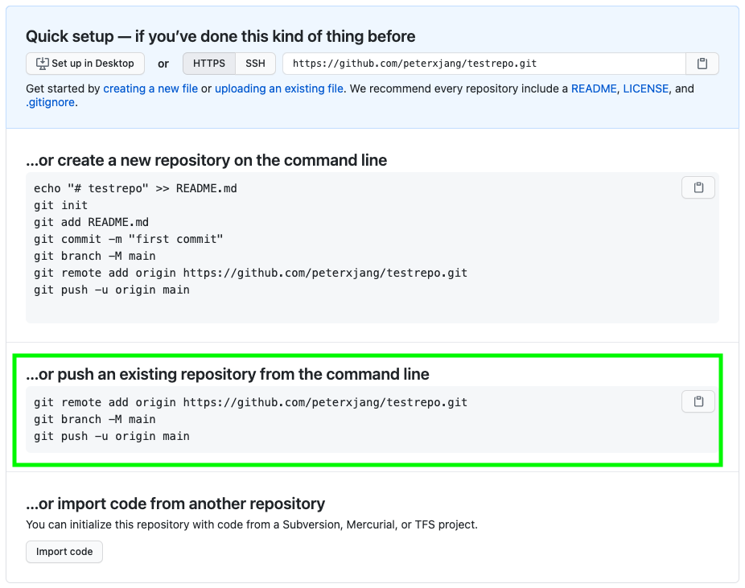

# Setup: Git and GitHub

## Setting up git on a computer

In the terminal, enter the following commands (only for a new computer):

```bash
git config --global color.ui true
git config --global user.name "YOUR NAME"
git config --global user.email "YOUR@EMAIL.com"
```

Be sure to replace `YOUR NAME` with your actual name and `YOUR@EMAIL.com` with your email (the one you used when you signed up with github.com).

To check if everything is configured correctly, you can run

```bash
git config --list
```

## Creating a git repository

To tell git to start tracking the folder you’re currently in (don’t do this in your actualize directory!):

```bash
git init
```

_NOTE: git init is only done once per project!_

## Saving versions with git

1. In your text editor, make changes and save the files.
2. In the terminal, enter `git add --all`

   - _This adds your files to the Git “shopping cart”_

3. In the terminal, enter `git commit -m 'some descriptive message explaining the changes'`

   - _This saves all the added changes as a new version (“checkout shopping cart”)_

4. Repeat steps 1, 2, and 3
   - Make changes
   - `git add --all`
   - `git commit -m 'some descriptive message explaining the changes'`

## Miscellaneous commands

```
git status
```

See current status of git

```
git log
```

See list of commits (If the list goes past the end of the screen, enter q to quit)

```
git log -p
```

See list of commits with changes
(If the list goes past the end of the screen, enter q to quit)

## Setting up your GitHub account

1. In your terminal:

   - Enter the following commands to reset your macOS Keychain credentials:
   - ```bash
     git credential-osxkeychain erase
     host=github.com
     protocol=https
     ```

   - _(press return twice if needed)_

2. In your web browser:
   - Create a GitHub personal access token: https://docs.github.com/en/free-pro-team@latest/github/authenticating-to-github/creating-a-personal-access-token
   - Copy the personal access token.
     DO NOT close the page yet - this will be the only time you can access the token.

## Push a local git repository to an online GitHub repository

1. In your web browser:

   - Create a new GitHub repository: https://github.com/new.

     - Be sure to use the same name as the local repository on your computer!

   - Copy the commands to push an existing repository from the command line.

     

2. In your terminal:
   - Paste the commands you copied from above.
     - If prompted for a **username**, enter your GitHub **username**.
     - If prompted for a **password**, enter your GitHub **personal access token** (from above)
3. In your web browser:
   - Refresh your web browser to double check that your code is online.

Now that your local repository is connected to GitHub, you can save changes using:

```
git add --all
git commit -m 'some descriptive message explaining the changes'
git push origin main
```
